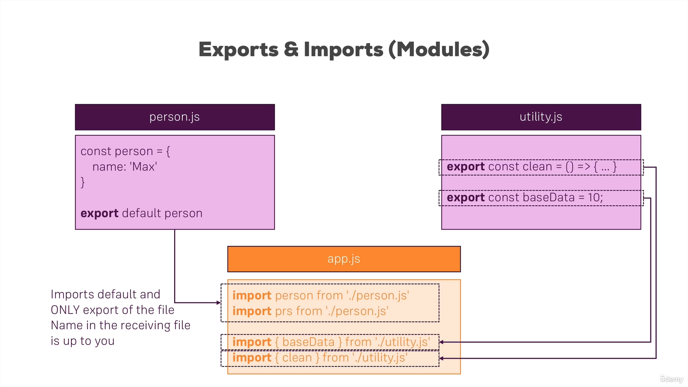
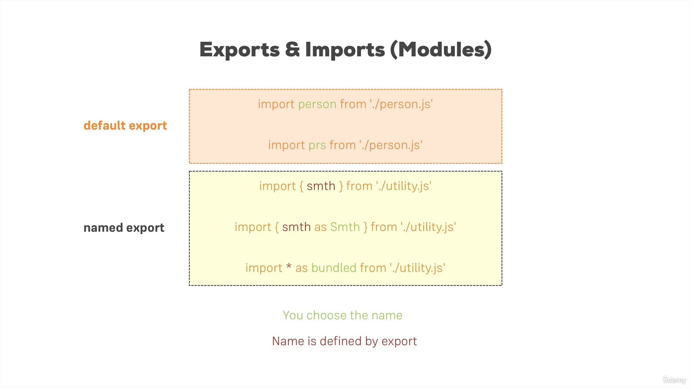

<p align="justify">
<strong>

# Getting Started with ReactJs


<hr>

- JavaScript is a programming language that allows us as a developer to run logic in the browser. And the great thing about that logic in the browser is that it can do things that manipulate what the user sees.
- JavaScript in the browser can manipulate to so-called Dom, the HTML elements that are rendered onto the screen.
- We can manipulate this with JavaScript. And that allows us to change what the users see without fetching a new HTML page. We don't need to request a new HTML page just to present something different to the user. So that's why JavaScript can help us.
- And since React is a JavaScript library, it looks like it can also help us with that. It might be an extra building block, and indeed, React.js is a client-side JavaScript library.
- It helps us with writing that client-side JavaScript code and it's all about building modern reactive user interfaces for websites.

## Building SPAs with ReactJs


- Now because things get easier with React, and because we can build those rich user interfaces with React and JavaScript when working with react, we often build so-called Single Page Applications.
- Because whilst we can use React to control parts of an HTML page, let's some interactive sidebar, and therefore we add a widget, you say to a page where a part of the page is controlled with React. It is more common to control the entire page with React. This means we use react for everything we see on the screen and even for switching pages.

- Using JavaScript through ReactJs to change what's visible on the screen and that often leads to a smoother UI and a better user experience.

## ReactJs Alternatives


- React - 
  
  - This tutorial is about ReactJs but it is worth knowing that there are alternatives to ReactJs.
  - React is one of the most popular front-end frameworks or libraries, however, you want to call it.
  - It's a lean and focused component-based UI Library.
  - It focuses on this component thing, and it doesn't have a lot of other features built in.
  - If you need other features like routing which we are, of course going to learn about in detail later on then you need to install an extra third-party library.
  - And many times it's very okay that we need to install third-party libraries to add certain pieces of functionality to your application because ReactJs itself just focuses on these components, which we're going to learn about in detail later on.

- Angular - 
  
  - Angular is another very important and very popular front-end framework.
  - Angular is a complete component-based UI framework. It also focuses on components just like ReactJs, but it ships more built-in features than ReactJs.
  - It also embraces  right from the start.
  - It can be overkill for smaller projects, therefore since it has way more features built in.
  - But for a large project, on the other hand, you don't need to rely on the community as much because there's more built into that framework.
  - The Syntax also looks different because whilst it is component focused, building these components works a bit differently with Angular than it does with ReactJS.
  
- Vue - 
  
  - VueJs is kind of like the mixture of Angular and ReactJS, in b/w those 2 extremes, if you want to call it like this.
  - It's also a complete component-based UI framework.
  - Also, it also includes a lot of features but a bit fewer features than Angular but more than ReactJs.
  - It includes core features like Routing, for example, and therefore with Vue we also have to rely less on the community.

## Javascript Refresher

- This section is mainly for beginners in JavaScript and is not recommended for people who already have decent experience working with JavaScript.

- For the detailed study we recommend you take JavaScript Lessons from here -> <a href="https://github.com/amandewatnitrr/javascript-practice"></a>

- But some of the topics still need to be updated which we will discuss here in this particular guide.

### Export and Import in Next Gen Js




### Spread & Rest Operators

- First, let's clear it out that it's just a single operator and not 2 different operators and is denoted by `...`.
- Spread: Used to split up array elements or object properties

  - For example:

        ```JS
        // If we want to add elements to from an old exsisting array to new array, we can do it as:

        var newArray =  [...oldArray,1,2];
        var newObject = [...oldObject,newProp:5];
        ```

- Rest: Used to merge a list of function arguments into an array
  
  - For example:

        ```Js
        // This allows us to pass multiple arguments as input to the function.

        function sort(...args) {
          return args.sort();
        }

        ```

### Destructuring

- Destructuring easily extracts array elements or object properties and stores them in variables.
- Destructuring allows you to extract a single element or properties and store them in variables.

## Components in ReactJs

- ReactJs is a Javascript library used for building User Interfaces.
- It makes building complex, interactive and reactive user interfaces simpler.
- ReactJs is all about components.

### Why Components in ReactJs

- ReacJs praises the concept of Components because of its Reusability aspect
- It allows us to separate our concerns
- Both are important concepts in programming in general.
- Having reusable building blocks helps us avoid repetition
- It allows us to keep our codebase small and manageable
- It allows us to split big chunks of code into multiple smaller functions

### How is a Component Built?

- In actuality, frontend development is all about HTML, CSS and JavaScript.
- In ReactJs, we combine all these together to build the User Interface.
- React allows us to create reusable and reactive components consisting of HTML and JavaScript (and CSS).
- ReactJs uses the "Declarative Approach" to build these components.
- It basically means that with ReactJs that we don't tell that certain HTML need to be placed in a certain manner on the User Interface as we do it with Vanilla JavaScript or just JavaScript.
- With ReactJs we will always define the desired end state or target state and let React figure out the actual JavaScript DOM instructions.

</strong>
</p>
