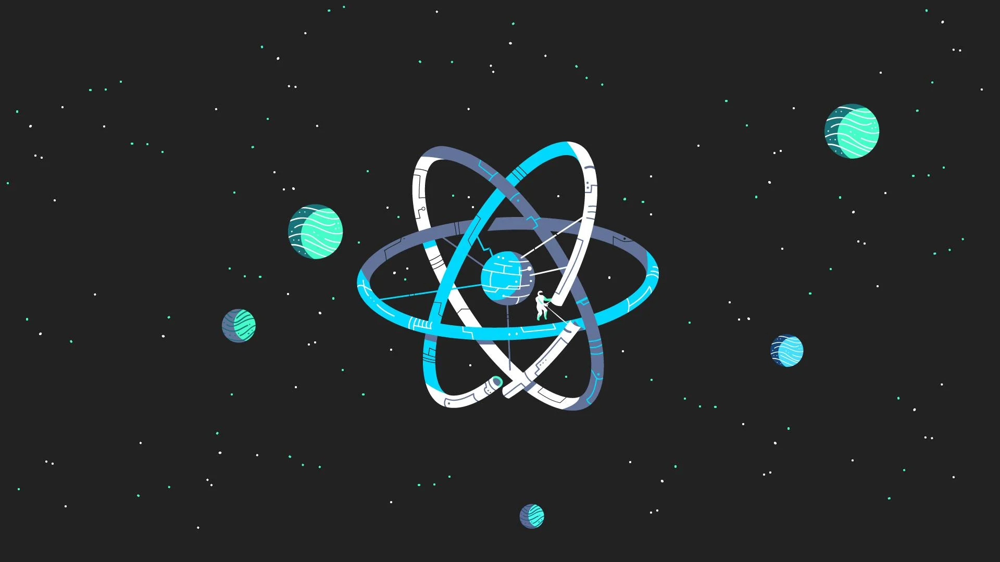

<strong>

# Getting Started with ReactJs

- JavaScript is a programming language that allows us as a developer to run logic in the browser. And the great thing about that logic in the browser is that it can do things that manipulate what the user sees. 
- JavaScript in the browser is able to manipulate to so-called Dom, the HTML elements that are rendered onto the screen. 
- We can manipulate this with JavaScript. And that allows us to change what the users sees without fetching a new HTML page. We don't need to request a new HTML page just to present something different to the user. So that's why JavaScript can help us. 
- And since React is a JavaScript library, it looks like it can also help us with that. It might be an extra building block, and indeed, React.js is a client-side JavaScript library. 
- It helps us with writing that client-side JavaScript code and it's all about building modern reactive user interfaces for websites.

## Building SPAs with ReactJs

- Now because thing get easier with React, and because we can build those rich user interfaces with React and JavaScript, when working with react, we often build so-called Single Page Applications.
- Because whilst we can use React to control parts of an HTML page, let's some interactive sidebar, and therefore we add a widget, you say to a page where a part of page is controlled with React. It is more common to control  the entire page with React. Which means we use react for everything we see on the screen and even for switching pages.

- Using JavaScript through ReactJs to change what's visible on the screen and that often leads to a smoother UI and a better user experience.

##  Alternatives

</strong>

