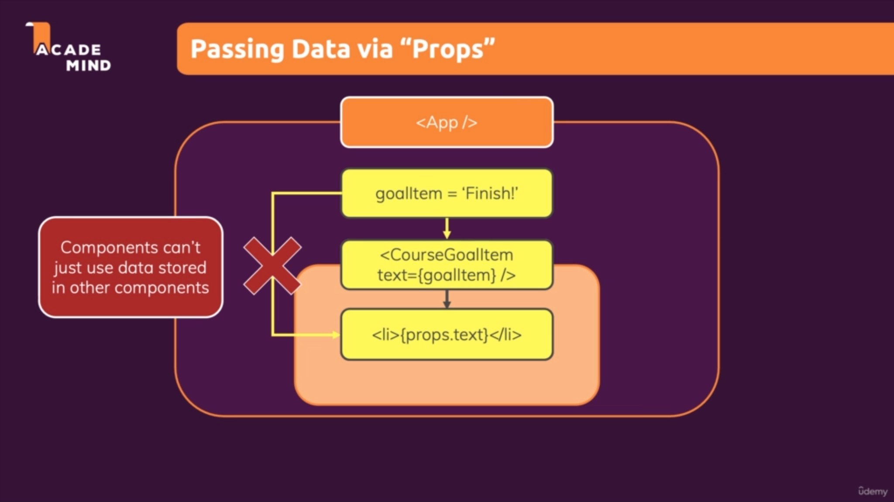

# Creating a React Project

- To get started working on a ReactJs Project make sure you have <a href="https://nodejs.org/en/download/"></a> installed on your system.
- Open the folder in the terminal where you want to create project and run the following commands:
-

    npx create-react-app react-application-name

- Also, make sure you don't have a prxy, firewall applied that might be blocking out your connection.
- Now as soon as the installation gets completed, run the following commands:
-

    cd react-application-name
    npm start

- This will automatically open the webpage on `localhost:3000` and you should see something similar as shown below:
  


## Introducing JSX

- JSX Code is nothing but HTML code inside of JavaScript.
- JSX stands for JavaScript XML because HTMl in the end is XML.
- This only works because there are transformation steps in JavaScript running behind the scens because of this process. The `npm start` process which we started which transformed this JavaScript code to more browser friendly code before everything is being served here.

## How ReactJs works??

- The Normal JavaScript follows an imperative approach.
- Like for example:

    ```javascript
    const para = document.createElement('p');
    para.textContent = 'This is the content of the Paragraph';
    document.getElementById('root').append(para);
    ```

    This is how we will deal when adding an element with JavaScript only. While doing the same in ReactJs is pretty easy.

- This works but it might get cubersome when dealing with huge codebase or complex user interfaces with dozens or hundreds of elements, which also might be changing and appearing and disappearing all the time, having to write all these instruction is a reall mess.
- With ReactJs instead, we just define the desired end state directly that we want whatever tag a paragraph, a heading or anything etc.., and then ReactJsgenerates these instructions behind the screen to bring that onto the screen.
- With ReactJs, we build a component tree.

So, let's do some practical and try implementing and working up with ReactJs.

- After spending quite some time we came up with this basic frontend with ReactJs.


## Passing Data via `Props`

- Let's say in your app component we have a variable called `goalitem = 'finish` which holds a string value. And than we have a custom component called `<CourseGoalItem />` component which has a list item inside of it ```<li>{goalitem}</li>``` where this `goalitem` should be displayed.
- The Problem is the variable `goalitem` lives in the app component and not in `<CourseGoalItem />` component. And to certain extent that's good because it makes the `<CourseGoalItem />` component independent if it doesn't store the concrete value internally.
- But we want to know what's being output by `<CourseGoalItem />` with help of the variable managed in App. And we don't have direct access to the HTML Code Output by some component in other components.
- Components can't just use data stored in other components.
- But than we can utilizze the concept of `props`

- We can pass data to the custom component by adding a attribute. And inside of that component, we can get access to all the attributes which might have been set on our custom component.


