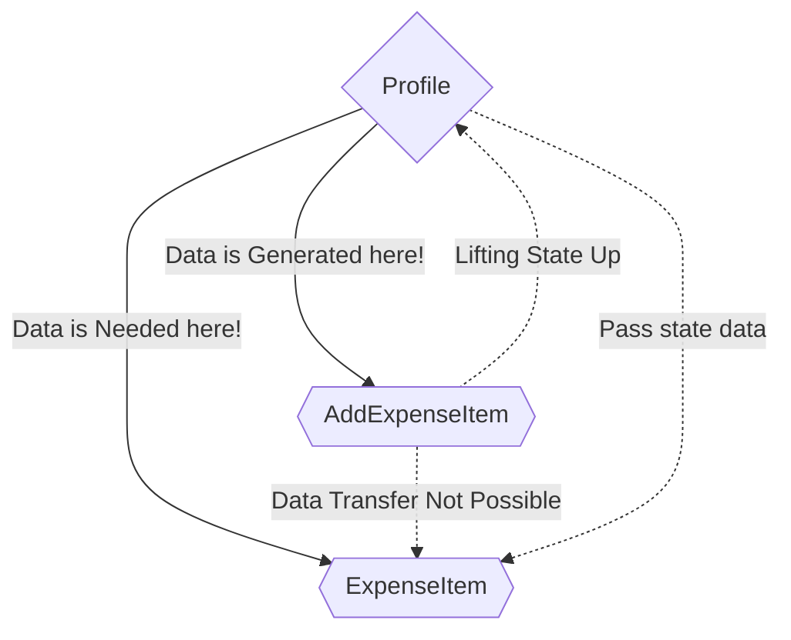

<strong>

# Components and Component Communication

## Child to Parent Component Communication

- So, in this tutorial after the previous tutorial where we successfully stored the data into variable and printed it onto the console after getting from the form, we don't want the data to be just there on the console log but added as `<ExpenseItem/>` to the Expense List.

- But, the problem is both are different componets and if you have a good look on the project we are working on, `<AddExpenseItem/>` and `<ExpenseItem/>` both are child components of `<Profile/>` component.

- Also, in order to get the `<ExpenseItem/>` component rendered for every new entry and the new entries for purpose of being rendered needs to be added to the `expensesData` variable in the `<Profile/>` component, for this we need to pass the data down to both `<ExpenseItem/>` and `<AddExpenseItem/>`.

- The flow of data is from Parent to Child Component when it comes to communiocation b/w `<Profile/>` and `<ExpenseItem/>` but in case of `<AddExpenseItem/>` it's Child to Parent.

- In the `<AddExpenseItem/>` we are already listening to the user input, we can create our own event props, we can expect functions as values and that would allow us to pass a fucntion from Parent Component to a Child Component and than call that function inside of the child component.
  
- And when then we then call a function, we can of course pass data to fucntion as a parameter and that's how we can communicate up from child to parent.

- Also, props can only be passed from parent to child and we can't skip intermediate components.

## Lifting State Up

- Consider this basic component tree which is roughly what we have in this demo application where we have an app component which in turn rederes `<ExpenseItem/>` and `<AddExpenseitem/>`. Now in this case `<AddExpenseItem/>` is a component which generates some data, some state. And here in our practice website, we are fetching some user input here.

- Now, it s is quite common that we do generate or fetch data in a component but we might not need that data in that comoponent. Instead, we need it in another component in the `<ExpenseItem/>` component. That's where the input data is needed at the end. Slightly, transformed packed into the object but it is the data we fetch in new expense. So, natuarally we would like to hand that data over but that doesn't work like this becuase we have no direct connection b/w two sibling components.

- We can only communicate from parent to child and child to parent, and two siblings therefore can't communicate each other. Therefore in order to make the 2 siblings communicate, we utilize the closest parent component which has direct or indirect access to both involved components, in this case the `<Profile/>` component.

- The `<Profile/>` component has access to both `<AddExpenseItem` and `<ExpenseItem/>` component becuase it renders both componentsin it's returned JSX code, that's why we wanna utilize that. Because now we can store our state in that closest involved parent component which ahs access to both involved components by `Lifting State Up`.

- So, by passing our generated state data from the `<AddExpenseItem/>` to the `<Profile/>` component. We are already doing this by utilizing the variables by calling the function we receive on `handleExpense(data)`. But the function isn't doing anything on itself rather we are passing it the data to the function that contains the entered information. By passing the variable containing the information to the function we are lifiting that state up.

- We are not keeping in the `<AddExpenseItem/>` component, rather we are lifting it up to the `<Profile/>` component. So, in there we can use it like `handleExpense()`.

## Controlled, Uncontrolled, Stateless and Stateful Components

- Controlled Component: It means that a value which is used in the component like the value selected in the dropdown is passed on to a parent component through variables/props and is received from the parent component. Both the currently set value as well as the function in the end that handles the selected value is not the part of Profile.

- In all the React Apps which we are building we will have a couple of components that manage some state like this `<AddExpenseItem/>` component which manages the state of the inputs. And then you will have other components which don't manage any state, like `<App/>` in our project here. And hence it's a stateless component also called presentational or dumb component because it doesn't have any internal state, it's just there to output some data. And in most React Applications you will have mostly presentational and dumb components than smart or stateful components 

</strong>

