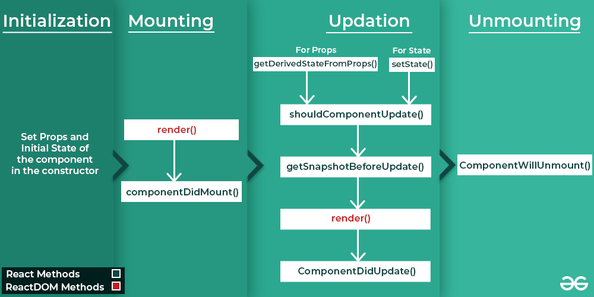

# Basic Questions in React

<p align="justify">


## useState vs useRef

- `useState`
  - manages state in functional components.
  - returns an array with 2 elements
        - first element is the state value.
        - second element is a function to update the state value.
  - When the state changes component re-renders.
  - when we want to manage state that, when updated, triggers a re-render of the component.
    - For example, managing the current state of a form input, controlling visibility of a component, etc. 
  - Example:
    ```Javascript
    const [count, setCount] = useState(0);
    ```

- `useRef`
  - to persist values across renders without causing re-renders.
  - It returns a mutable object(`current` property) that can hold values.
  - changes to the `current` property do not cause re-renders.
    - For example, holding reference to a DOM element, keeping track of values without causing any re renders. 
  - example:
    ```Javascript
    const countRef = useRef(0);
    ```

## What is React JSX? Why JSX?

- JSX stands for JavaScript XML.
- JSX allows us to write HTML in Javascript and forms the basis for React Development.
- JSX creates an element in React that gets rendered in the UI. It is transformed into JavaScript functions by the compiler at runtime. 
- Error handling and warnings become easier to handle when using JSX

- JSX is faster than normal Javascript, as it performs optimization while transforming to regular Javascript.


## What is Babel?

- Babel is a Javascript compiler that converts modern Javascript into a version of Javascript that can be run by the browsers.
- It allows the developers to use the latest ECMAScript or Javascript features without worrying about browser support.
- Babel operates using the Plugin Architecture.
- Each plugin performs a specific task, such as transforming arrow functions, classes, etc.
- Babel can also include polyfills to support features that are not available in the older browsers, but also that are not available in some modern browsers.
  - Polyfilling is a technique to provide modern functionality to older browsers that do not support certain features or APIs.
  - It is a code that basically replicates the behaviour of a feature or API that is missing in target browser. 

## What is Vitual DOM, and how it makes things faster??

- Virtual DOM is a lightweight copy of the actual DOM.
- It is a Javascript object that has the same properties as the actual DOM.
- It is a tree of React elements and components.
- When the state of the application changes, the virtual DOM gets updated instead of the actual DOM.
- The virtual DOM then compares the previous state of the virtual DOM with the new state of the virtual DOM. It then updates the actual DOM with the changes that were made to the virtual DOM. This process is called `reconciliation`.
- This process of reconciliation is faster than updating the actual DOM directly.
- The Process of comparing the current virtual DOM with the previous one is known as `diffing`.
- The process of updating the actual DOM with the changes that were made to the virtual DOM is known as `patching`.
- So,
  - React visualizes the DOM as a tree of React elements and components. 
  - When a change is made to the application, a new virtual DOM is created, represented as a tree of React elements and components.
  - Each element in the application is a node in the virtual DOM tree.
  -  The new vitual DOM is compared with the previous virtual DOM tree, and notes down the differences between the two.
  - After this, it finds the best optimal way to make the changes to the actual DOM.
  - Now, only the updated elements are re-rendered in the actual DOM.


## What is the difference between a controlled and uncontrolled component?

- Controlled Component
  -  The value of input element is controlled by React.
  - A controlled component is a component that renders form elements and controls them by keeping the form data in the component's state.
  - The component renders a form element with a value and an onChange handler.
  - The value of the form element is controlled by the component's state.
  - When the user types in the form element, the onChange handler is triggered, updating the component's state with the new value.
  - The component re-renders with the new value.
  - Example:
    ```Javascript
    import React, { useState } from 'react';

    const ControlledComponent = () => {
      const [value, setValue] = useState('');

      const handleChange = (event) => {
        setValue(event.target.value);
      };

      return (
        <div>
          <input type="text" value={value} onChange={handleChange} />
        </div>
      );
    };

    export default ControlledComponent;
    ```
    
- Uncontrolled Component
  - The value of input element is controlled by the DOM.
  - An uncontrolled component is a component that renders form elements and controls them by using a ref to get their current values from the DOM.
  - In an uncontrolled component, the source of truth is the DOM.
  - The component renders a form element with a ref.
  - The value of the form element is controlled by the DOM.
  - When the user types in the form element, the DOM updates its value.
  - The component re-renders with the new value.
  - Example:
    ```Javascript
    import React, { useRef } from 'react';

    const UncontrolledComponent = () => {
      const inputRef = useRef();

      const handleClick = () => {
        alert(inputRef.current.value);
      };

      return (
        <div>
          <input type="text" ref={inputRef} />
          <button onClick={handleClick}>Click</button>
        </div>
      );
    };

    export default UncontrolledComponent;
    ```
    
## What is the difference between a functional component and a class component?

- Functional Component
  - A functional component is a component that is written as a function.
  - It accepts props as an argument and returns a React element.
  - It is also known as a stateless component.
  - Example:
    ```Javascript
    import React from 'react';

    const FunctionalComponent = (props) => {
      return <div>{props.message}</div>;
    };

    export default FunctionalComponent;
    ```
    
- Class Component
  - A class component is a component that is written as a class.
  - It extends the React.Component class and has a render method.
  - It is also known as a stateful component.
  - Example:
    ```Javascript
    import React, { Component } from 'react';

    class ClassComponent extends Component {
      render() {
        return <div>{this.props.message}</div>;
      }
    }

    export default ClassComponent;
    ```
    
## What is the difference between createElement and cloneElement?

- createElement
  - The `createElement` function is used to create a React element.
  - It takes 3 arguments:
    - The type of the element.
    - The props of the element.
    - The children of the element.
  - Example:
    ```Javascript
    import React from 'react';

    const element = React.createElement('div', { className: 'box' }, 'Hello World');

    export default element;
    ```
    
- cloneElement
  - The `cloneElement` function is used to clone a React element.
  - It takes 2 arguments:
    - The element to clone.
    - The props to add to the cloned element.
  - Example:
    ```Javascript
    import React from 'react';

    const element = (
      <div className="box">
        <span>Hello World</span>
      </div>
    );

    const clonedElement = React.cloneElement(element, { className: 'box-red' });

    export default clonedElement;
    ```

## What is key in React?

- The `key` prop is used to identify elements in an array.
- It is used by React to identify which items have changed, been added, or been removed.
- It is important to include a key prop when rendering an array of elements.
- Example:
  ```Javascript
  import React from 'react';

  const List = () => {
    const items = ['Item 1', 'Item 2', 'Item 3'];

    return (
      <ul>
        {items.map((item, index) => (
          <li key={index}>{item}</li>
        ))}
  )
  export default List;
  
  ```
  - But there's an issue with using index as key:
    - If the order of the items changes, the key will remain the same.
    - If an item is removed from the middle of the array, the key will remain the same.
    - If an item is added in the middle of the array, the key will remain the same.
    - This can cause issues with the component's state and can lead to unexpected behaviour. 


## What is prop drilling?

- Prop drilling is the process of passing props from one component to another component down the hierarchy.
- It can be a tedious process if the components are deeply nested.
- Example:
  ```Javascript
  import React from 'react';

  const ComponentA = ({ message }) => {
    return <ComponentB message={message} />;
  };

  const ComponentB = ({ message }) => {
    return <ComponentC message={message} />;
  };

  const ComponentC = ({ message }) => {
    return <div>{message}</div>;
  };

  export default ComponentA;
  ```
  
  
  
## What is context?

- Context is used to pass data through the component tree without having to pass props down manually at every level.
- Context is primarily used when some data needs to be accessible by many components at different nesting levels.
- Context is designed to share data that can be considered “global” for a tree of React components.
- Context is primarily used when some data needs to be accessible by many components at different nesting levels.
- Context is designed to share data that can be considered “global” for a tree of React components.
- Example:
  ```Javascript
  import React, { createContext, useState, useContext } from 'react';

  const MessageContext = createContext();

  const ComponentA = () => {
    const [message, setMessage] = useState('Hello World');

    return (
      <MessageContext.Provider value={message}>
        <ComponentB />
      </MessageContext.Provider>
    );
  };

  const ComponentB = () => {
    return <ComponentC />;
  };

  const ComponentC = () => {
    const message = useContext(MessageContext);

    return <div>{message}</div>;
  };

  export default ComponentA;
  ```
  
## What is the difference between state and props?

- State
  - State is a data structure that is used to hold simple data.
  - State is managed within the component and is mutable.
  - State can be changed using the `setState` function.
  - State can be changed using the `setState` function.
  - State is used to handle simple data and is local or specific to that component.
  - Example:
    ```Javascript
    import React, { useState } from 'react';

    const Component = () => {
      const [message, setMessage] = useState('Hello World');

      return <div>{message}</div>;
    };

    export default Component;
    ```
    
- Props
  - Props are used to pass data from one component to another component.
  - Props are used to handle complex data and are passed down from parent component to child component.
  - Example:
    ```Javascript
    import React from 'react';

    const Component = ({ message }) => {
      return <div>{message}</div>;
    };

    export default Component;
    ```

## React Lifecycle of Components

- Every React component has 4 stages of its lifecycle:
  - Initialization
  - Mounting
  - Updating
  - Unmounting



- Initialization
  - Initialization is the process of defining the props and state of a component.
  - This is generally done by the constructor method.
  - It is called only once during the component's lifecycle.

- Mounting
  - Mounting is the process of creating a React component and inserting it into the DOM.
  - Once the initialization is done, the component is mounted on the DOM, and render method is called.
  - The functions that are called during the mounting phase are:
    - `constructor()`
    - `static getDerivedStateFromProps()`
    - `render()`
    - `componentDidMount()`: This method is called after the component is mounted on the DOM, i.e. after execution of `render()`.

- Updation
  - Updation is the process of updating the state or props of a component.
  - The functions that are called during the updation phase are:
  
    - `static getDerivedStateFromProps()`: This method is called before every render method in both mounting and updating phase.It takes updated props and current state as an argument.
    
    - `setState()`: This is not a lifecycle method, and can be invoked explicitly at any instant. This function is used to update the state of the component.
    
    - `shouldComponentUpdate()`: let's react know whether the component's output is affected by the current change in state or props.
      - Basically it decides whether to re-render the component or not.
      - If this function returns false the subsequent steps of rendering will not be carried out.
      - The function can't be used in case of `forceUpdate()`.
      
    - `getSnapshotBeforeUpdate()`: stores the previous state of the DOM before the update.
      - It is called right before the changes from the virtual DOM are to be reflected in the DOM.
      
    - `componentDidUpdate()`: the function is invoked after the component is re-rendered.
    
- Unmounting
  - Unmounting is the process of removing a React component from the DOM.
  - The function that is called during the unmounting phase is:
    - `componentWillUnmount()`: This method is called before the component is removed from the DOM.
      - It denotes the end of Lifecycle for a component.

## What is the difference between Presentational and Container Components?

- Presentational Components
  - Presentational components are concerned with how things look.
  - They are concerned with the UI.
  - Have no major dependencies on the rest of the app.
  - May contain other Presentational and Container components inside it.

- Container Components
  - Container components are concerned with how things work.
  - They are concerned with passing data down to the Presentational components.
  - May contain both presentational and container components inside it, but they donot have a DOM or markup of their own.
  - 


</p>